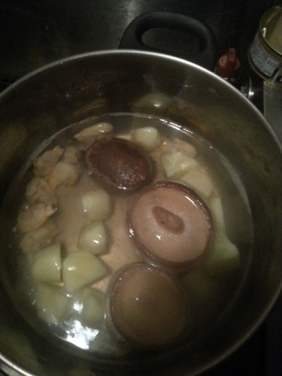
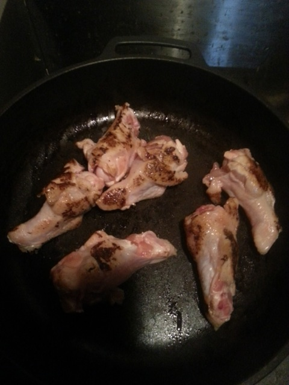
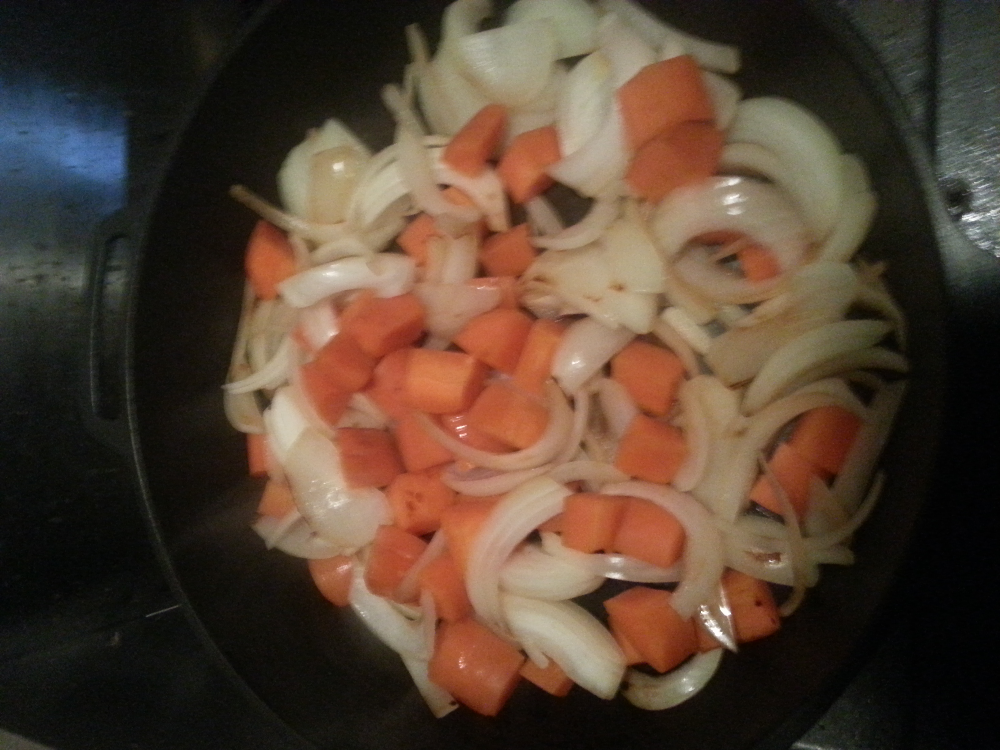
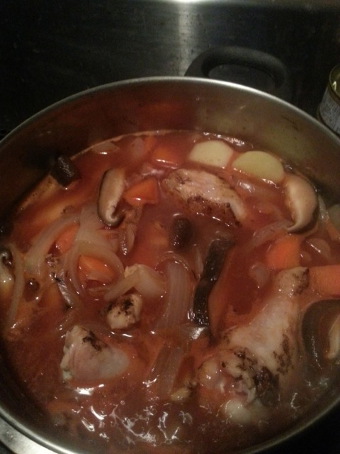
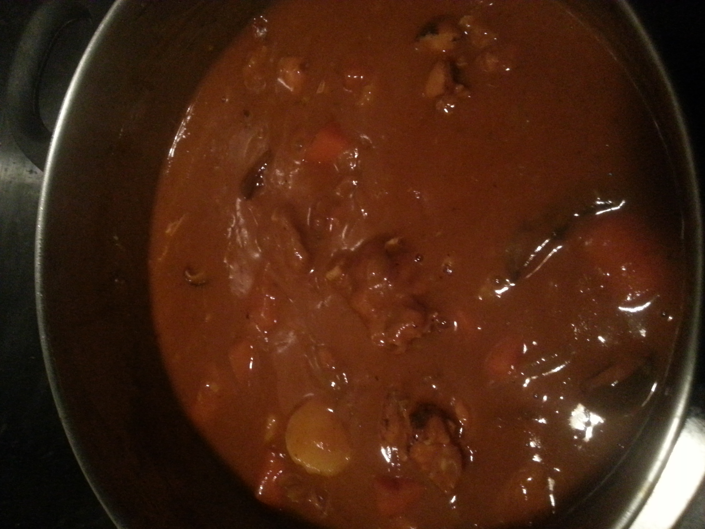
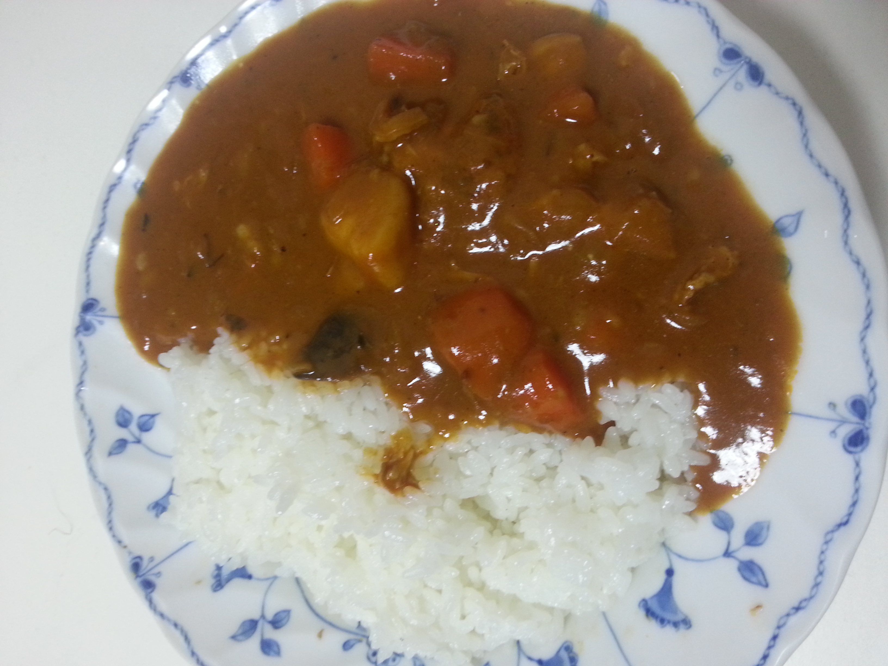

# 小松カレー (簡易版・春夏向け)

## 材料 (4〜5皿)

* 手羽元 400g (4〜6個)
* にんじん 中1個
* たまねぎ 大1個
* じゃがいも 小4個
* きのこ 適量
  * 使うときは一度冷凍させる
* トマトジュース 200ml
* 水 600ml
  * カレールーの箱に書かれている量 - 200ml
* カレールー 4、5皿分

[トマトジュース]

> 味の調整が簡単なので、無塩がおすすめ。
> 楽をしたければ、食塩が入っているものがいいと思います。

[カレールー]

> 中辛がいいと思います。辛口だと味見をした時に味覚が落ちるので、微調整が難しいのと、アレンジでスパイスを加えるのにちょうどいいので。
> 辛さも好きな辛さようにしやすいと思います。

## 手順

### 1. 食材を切る

いつも作ってる感じで切ってもらえばいいと思います。  
ただ、皮がついていたほうが煮込んだ時にいい出汁が出るので、人参だけは皮付きのままで。  

### 2. 出汁取り煮こむ

きのこを入れて煮込みはじめます。  
冷凍しておくときのこの細胞が軽く壊れるのでだしの出が良くなります。  
じゃがいももトロトロがお好きであれば一緒に入れましょう。  
今回は趣味であさりも入ってます。  

### 3. お肉焼く

フライパンで焼いたら鍋に移します。  
最終的に煮込むので周りに焼き色が付く程度でいいです。  
フライパンは洗わずにそのまま野菜を炒めましょう。    

### 4. 野菜炒める

野菜をじっくり炒めます。  
野菜を炒めを割ったら鍋に移します。  
炒め終わったらフライパンに少量の水(100~150ml)を入れて、軽く煮立たせ、鍋に移します。  
痛めてる間に旨味成分が外に出ているからです。  

### 5. コトコト煮こむ

### 6. ルーとトマトジュースを入れて煮込む

トマトジュースは煮込むとドロドロになっていきます。  
水を加えて調整します  

### 7. 完成

ガラムマサラがあれば、盛り付けをしたあとに一振りするといいです。  

